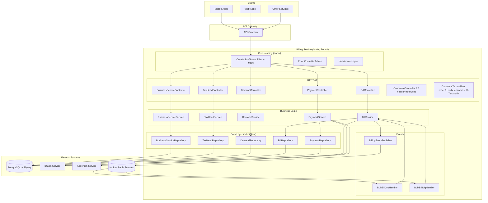

# Billing Service (Java)

A Java-based DIGIT microservice for comprehensive billing, demand, and payment
management. It handles business service configurations, tax head definitions,
demand creation and lifecycle management, bill generation (single and bulk),
and payment processing with multi-tenant support. Provides REST APIs for the
complete billing workflow from demand creation to payment reconciliation.

Built on Java 25 / Spring Boot 4 and the `org.digit:tracer` platform library.

## Overview

**Service Name:** Billing

**Purpose:** Provide multi-tenant billing, demand, and payment management
capabilities including business service configuration, tax head management,
demand lifecycle, bill generation with expiry handling, asynchronous bulk bill
generation, and payment processing with status transitions.

**Owner/Team:** DIGIT Platform Team

## Architecture

**Tech Stack:**
- Java 25
- Spring Boot 4 (virtual threads, `JdbcClient` — plain JDBC, no JPA)
- PostgreSQL 14+ (Flyway migrations)
- `org.digit:tracer` platform library (correlation headers, bare-array error
  contract, `PubSubClient` messaging over Kafka or Redis Streams,
  `logAwareRestClient` outbound HTTP, OpenTelemetry observability)

**Core Responsibilities:**
- Manage business service configurations (billable services with expiry settings)
- Define and manage tax heads (fee/tax components with per-service ordering)
- Create and manage demands (billing liabilities with line items and lifecycle)
- Optionally roll forward arrears from the previous open demand
- Generate bills from billable demands (ACTIVE/FROZEN/PARTIALLY_PAID) with
  priority-based expiry calculation
- Generate bills in bulk asynchronously via pub/sub jobs with DLQ retry
- Handle bill status transitions (active, cancelled, paid, partially paid, expired)
- Process payments against bills with idgen receipt generation and
  apportion-service distribution across tax heads
- Multi-tenant scoping via `X-Tenant-ID`
- Audit trail (row-hashed snapshots) for every mutation

**Dependencies:**
- PostgreSQL 14+
- IDGen service (bill numbers, receipt numbers, cash transaction numbers)
- Apportion service (payment distribution across tax heads)
- Kafka **or** Redis Streams (bulk-bill job pipeline; backend switched by config)

### High-level Architecture Diagram



## Features

- ✅ Business service CRUD with bill expiry configuration
- ✅ Tax head management with per-service order uniqueness and categorization
- ✅ Demand lifecycle management (bulk create/update, patch, freeze, cancel)
- ✅ Demand period uniqueness enforced by a Postgres GiST exclusion constraint
- ✅ Demand arrear roll-forward for outstanding amounts (config-gated)
- ✅ Bill generation from billable demands; a repeat generate returns the existing
  active bill. A *racing* duplicate now returns `409` instead of resolving silently —
  re-issuing returns the winner's bill (see Bill Management)
- ✅ Asynchronous bulk bill generation (keyset-batched jobs over pub/sub, DLQ
  with per-consumer retry)
- ✅ Bill status management (active, cancelled, paid, partially paid, expired)
- ✅ Payment processing with idgen receipt generation
- ✅ Payment validation endpoint for pre-flight checks (dry run)
- ✅ Payment mode-specific instrument validation
- ✅ Duplicate payment detection
- ✅ Payment apportionment across bills and tax heads (apportion service)
- ✅ Over-collection guards on demand and line-item settlement
- ✅ Multi-tenant support via `X-Tenant-ID` scoping — or `requestMetadata.tenantId` in the body
  on the canonical routes
- ✅ Canonical (header-free) twin of all 27 routes under `/v3/canonical/…`, for callers that
  cannot set custom headers
- ✅ Comprehensive audit trail (SHA-256 row-hashed snapshots) for all mutations
- ✅ Bill expiry calculation with priority-based logic (demand overrides service)
- ✅ Flexible search and filtering (CSV list params, subquery-backed payment filters)
- ✅ Money values as exact decimals end to end — serialized as quoted strings
  with trailing zeros trimmed, never binary floating point

## Installation & Setup

### Local Development

**Prerequisites:** JDK 25 (e.g. via sdkman), Maven, PostgreSQL on `:5432`
(`postgres`/`postgres`), Kafka on `:9092` **or** Redis on `:6379`, IDGen on
`:8100`, Apportion on `:8280`.

```bash
# 1. Database — boot-time Flyway is OFF (the init container owns public, and
#    tenant-migration owns each tenant schema). For a scratch local database,
#    either run with SPRING_FLYWAY_ENABLED=true or apply src/main/resources/db/migrate.sh
createdb billing_db

# 2. Run
JAVA_HOME=~/.sdkman/candidates/java/25.0.3-tem mvn spring-boot:run
# or: java -jar target/billing-3.0.0-SNAPSHOT.jar
```

Health: `GET /billing/actuator/health` · Prometheus: `GET /billing/actuator/prometheus`

To run the bulk-bill pipeline against **Redis Streams** instead of Kafka:

```bash
java -jar target/billing-3.0.0-SNAPSHOT.jar \
  --tracer.pubsub.type=redis \
  --spring.data.redis.host=localhost --spring.data.redis.port=6379 \
  --management.health.redis.enabled=true
```

Note this is local-only. With `digit.tenant-migration.enabled=true` the backend must be
**kafka**, because `account` publishes `account-migration` to kafka only — on redis the
subscribe succeeds against a broker that never delivers, and no tenant schema is ever
provisioned.

### Tests

```bash
JAVA_HOME=~/.sdkman/candidates/java/25.0.3-tem mvn clean verify   # no external deps
```

- Unit suites cover the demand validation matrix, decimal semantics, bill
  expiry, instrument rules, apportion reconciliation, bulk response shaping,
  patch windows, arrears, and decimal-parity regression pins
- A MockMvc contract suite pins header enforcement/echo, statuses, the
  bare-array error shape, and decimal-as-string serialization

### Postman

Import [`Billing-3.0.postman_collection.json`](Billing-3.0.postman_collection.json).
Collection variables: `baseUrl` (default `http://localhost:8080/billing`),
`tenantId` (`pg`), `userId`. Create responses chain automatically — "Create
demands (bulk)" saves `{{demandId}}`, "Generate Bill" saves `{{billId}}`,
"Create Payment" saves `{{paymentId}}` — so the get/patch/freeze/cancel/search
requests work without manual id copying.

## Configuration

All settings are Spring properties (override via `application.properties`,
environment, or CLI flags).

| Property | Default |
|----------|---------|
| `server.port` | `8080` |
| `server.servlet.context-path` | `/billing` |
| `billing.canonical-path` | `canonical` — path segment of the canonical routes; moves all 27 together |
| `spring.datasource.url` | `jdbc:postgresql://localhost:5432/billing_db` |
| `spring.datasource.username` / `password` | `postgres` / `postgres` |
| `spring.flyway.enabled` | `false` — the init container owns `public`, tenant-migration owns tenant schemas |
| `digit.tenant-migration.enabled` | `false` — per-tenant schemas, set once at initial deployment. **The request filter is active either way**: it wraps every request in a transaction and requires `X-Tenant-ID`, which the canonical routes satisfy by promoting `requestMetadata.tenantId` to that header first |
| `digit.tenant-migration.schema-table` | `billing_schema` — must equal the init container's `migrate.sh -table` |
| `digit.tenant-migration.consumer-group` | `billing` — distinct from the `billing-service` group used for the bulk-bill topics |
| `billing.demand-enable-arrears` | `true` |
| `billing.max-instrument-date-age-days` | `90` |
| `billing.bulk-bill-consumer-batch-size` | `10` |
| `billing.idgen.host` | `http://localhost:8100` |
| `billing.idgen.generate-path` | `/idgen/v3/generate` |
| `billing.idgen.bulk-generate-path` | `/idgen/v3/generate/bulk` |
| `billing.idgen.bill-number-template` | `BillNumber` |
| `billing.idgen.receipt-number-template` | `ReceiptNumber` |
| `billing.idgen.transaction-number-template` | `TransactionNumber` |
| `billing.apportion.host` | `http://localhost:8280` |
| `billing.apportion.bill-path` | `/apportion/v3/bills` |
| `billing.topics.bulk-bill-generation` | `bulk-bill-generator` |
| `billing.topics.bulk-bill-generation-dlq` | `bulk-bill-generator-dlq` |
| `tracer.http.readTimeoutMs` | `5000` |
| `tracer.pubsub.type` | `kafka` |
| `spring.kafka.bootstrap-servers` | `localhost:9092` |
| `spring.data.redis.host` / `port` | `localhost` / `6379` |
| `management.opentelemetry.tracing.export.otlp.endpoint` | `http://localhost:4318/v1/traces` |
| `management.tracing.sampling.probability` | `1.0` |

Pub/sub is always wired for the bulk-bill pipeline — a publish failure fails
the triggering request rather than silently dropping the job. Broker topology
(partitions, replication, consumer tuning) is left to the deployment's Kafka/
Redis configuration rather than app-level knobs.

## API Reference

Base path is the context path (default `/billing`). Headers: **`X-Tenant-ID`
is required on every 3.0 route; `X-User-ID` additionally on every write (non-GET)**.
`X-Correlation-ID`, `X-Tenant-ID`, `X-User-ID`, `X-Request-ID` are echoed on
responses.

Every operation below also exists header-free under `/v3/canonical/…`, taking the same
ids in the body instead — see [Canonical (header-free) API](#canonical-header-free-api).

Errors are bare JSON arrays of `{code, message, description, params}` (tracer
contract) on the 3.0 routes; the canonical routes wrap that same array in
`{responseMetadata, errors}`. **Money fields are quoted decimal strings**
(`"totalAmount": "400"`), with trailing zeros trimmed.

### Business Service Management

#### 1) Create Business Services
- `POST /v3/business-services` — batch, all-or-nothing
```json
[{
  "code": "PT",
  "name": "Property Tax",
  "collectionMode": "BOTH",
  "allowedPaymentModes": ["CASH", "ONLINE", "CHEQUE"],
  "billExpiryDays": 30,
  "partialPaymentAllowed": true,
  "minPayableAmount": "10.50",
  "currency": "INR",
  "effectiveFrom": 1735669800000,
  "effectiveTo": 1767205800000,
  "isActive": true
}]
```
- Responses: `201` (array), `400` (validation / empty array `INVALID_REQUEST` /
  in-request duplicates `DUPLICATE_VALUES`), `409 CONFLICT` (code exists), `500`

#### 2) Search Business Services
- `GET /v3/business-services?code=&isActive=&effectiveOn=&limit=&offset=`
- `limit` 1–100 (default 25); `effectiveOn` is an epoch-millis point-in-window filter
- Responses: `200`, `400`, `500`

#### 3) Get Business Service by Code
- `GET /v3/business-services/{code}` → `200`, `404 NOT_FOUND`, `400`

#### 4) Update Business Service (full replace)
- `PUT /v3/business-services/{code}` — same body as create minus `code`;
  bumps `version`, audits the previous state → `200`, `400`, `404`

#### 5) Patch Business Service
- `PATCH /v3/business-services/{code}` — partial; effective-window rules
  validated against stored values (`INVALID_EFFECTIVE_RANGE` /
  `INVALID_EFFECTIVE_TO` / `INVALID_EFFECTIVE_FROM`) → `200`, `400`, `404`

#### 6) Delete Business Service
- `DELETE /v3/business-services/{code}` — **hard delete** after an audit
  snapshot marked inactive → `200` `{"deleted": true}`, `404`,
  `409 DEPENDENCY_EXISTS` (referenced by tax heads)

### Tax Head Management

#### 7) Create Tax Heads
- `POST /v3/tax-heads` — batch; `order` must be unique per business service
  (checked in-request, against the DB, and by constraint)
```json
[{
  "code": "PT_TAX",
  "name": "Property Tax Base",
  "businessServiceCode": "PT",
  "category": "TAX",
  "order": 1,
  "effectiveFrom": 1735669800000,
  "isActive": true
}]
```
- Responses: `201`, `400`, `409` (`CONFLICT` / `DUPLICATE_ORDER`),
  `422 INVALID_BUSINESS_SERVICE` (unknown/inactive service), `500`

#### 8–12) Search / Get / Update / Patch / Delete Tax Heads
- Same shapes as business services under `/v3/tax-heads`; search filters:
  `code`, `category`, `businessServiceCode`, `isActive`, `limit`, `offset`.
  Delete → `409 DEPENDENCY_EXISTS` when demand line items reference the code.

### Demand Management

#### 13) Create Demands (bulk)
- `POST /v3/demands`
```json
[{
  "businessServiceCode": "PT",
  "periodFrom": 1735669800000,
  "periodTo": 1767205799000,
  "consumerCode": "PT-001-2024",
  "billExpiryDays": 45,
  "payer": ["IND-001"],
  "lineItems": [
    { "taxHeadCode": "PT_TAX", "amount": "1500.00", "collectedAmount": "0" }
  ],
  "status": "ACTIVE",
  "metadata": { "assessmentYear": "2024-25" }
}]
```
- Two failure classes, handled differently:
  - **Validation** failures (a pure function of the request, checked before any DB
    work) are still reported per item. All succeed → `201` plain array; all fail →
    `400` flattened errors (`422` when every failure is referential:
    `UNKNOWN_BUSINESS_SERVICE` / `UNKNOWN_TAX_HEAD` / `INVALID_TAX_HEAD`); mixed →
    `207` `{success: [...], failures: [{index, errors}]}`
  - **Write** failures are fatal to the whole request: `409 DEMAND_CONFLICT` (period
    overlap) or `404 NOT_FOUND` (unknown id, on update), naming the offending item.
    **No demands are created or updated.** They used to be collected per item, each
    in its own transaction, but the tenant-migration filter now wraps the request in
    one transaction — the first failed statement aborts it, so later items would be
    reported as failures they never had and the commit would throw after a
    success-shaped body was already built.
- Item error codes: `INVALID_PERIOD`, `INVALID_AMOUNT`, `INVALID_COLLECTION`,
  `DUPLICATE_TAX_HEAD`, `DEMAND_CONFLICT` (period overlap), `CREATION_FAILED`
- With arrears enabled, the previous open demand's outstanding is prepended as
  a `<BSCODE>_ARREAR` line item, that demand becomes `ROLL_FORWARDED`, and
  its still-ACTIVE bill (if any) is cancelled

#### 14) Update Demands (bulk, full replace)
- `PUT /v3/demands` — items carry `id`; only DRAFT/ACTIVE demands are
  editable; line items are replaced. Same bulk response shaping (success `200`).

#### 15) Search Demands
- `GET /v3/demands?businessServiceCode=&consumerCode=&status=&createdFrom=&createdTo=&limit=&offset=`

#### 16) Get Demand by ID
- `GET /v3/demands/{id}` → `200`, `400 INVALID_PATH_PARAM`, `404`

#### 17) Patch Demand
- `PATCH /v3/demands/{id}` — `consumerCode`, `payer`, `status` (DRAFT/ACTIVE),
  `lineItems` (replaced; totals recomputed) → `200`,
  `400` (`INVALID_STATUS_TRANSITION` when not DRAFT/ACTIVE, validation codes,
  `DEMAND_CONFLICT` when a status change lands on an occupied period), `404`

#### 18) Freeze Demand
- `POST /v3/demands/{id}/freeze` — ACTIVE → FROZEN only → `200`, `404`,
  `409 FREEZE_FAILED`

#### 19) Cancel Demand
- `POST /v3/demands/{id}/cancel` — DRAFT/ACTIVE only; optional body
  `{"reasonCode": "...", "note": "..."}` merges into metadata as
  `cancellation_reason_code` / `cancellation_note` → `200`, `404`,
  `422 CANCEL_FAILED`

### Bill Management

#### 20) Generate Bill
- `POST /v3/bills/generate`
```json
{
  "businessServiceCode": "PT",
  "consumerCode": "PT-001-2024",
  "payerId": "CITIZEN001",
  "payerName": "John Doe",
  "payerAddress": "123 Main Street",
  "payerMobileNumber": "+919876543210",
  "payerEmail": "john.doe@example.com"
}
```
- Generates from billable demands (ACTIVE/FROZEN/PARTIALLY_PAID); an existing
  unexpired ACTIVE bill is returned as-is (`201`); an expired one is expired
  and regenerated; ACTIVE source demands are frozen. A concurrent duplicate
  (losing the `uniq_active_bill` race) now returns `409 CONFLICT` — re-issuing the
  request returns the winner's bill. This used to retry internally and hand back a
  silent `201`; that retry cannot work inside the filter's request transaction,
  which the failed insert has already aborted.
- Responses: `201`, `422` (`INVALID_BUSINESS_SERVICE`, `NO_ELIGIBLE_DEMANDS`),
  `400 GENERATION_FAILED` (zero outstanding, idgen failure), `500`

#### 21) Search Bills
- `GET /v3/bills?businessServiceCode=&consumerCodes=&billNumbers=&billIds=&status=&mobileNumber=&email=&limit=&offset=`
- `consumerCodes`/`billNumbers`/`billIds` are comma-separated (invalid UUIDs
  in `billIds` are silently dropped)

#### 22) Cancel Bill
- `POST /v3/bills/cancel`
```json
{
  "businessServiceCode": "PT",
  "consumerCode": "PT-001-2024",
  "statusToBeUpdated": "CANCELLED",
  "metadata": { "reason": "Consumer request" }
}
```
- `statusToBeUpdated` must be `CANCELLED` (else `400 INVALID_STATUS`); the
  metadata is merged into the bill → `200`, `404` (no active bill), `400`

#### 23) Generate Bills in Bulk (asynchronous)
- `POST /v3/bills/bulk-generate` — `{"businessServiceCode": "PT", "metadata": {...}}`
- Snapshots the consumer universe, publishes keyset-batched jobs
  (`billing.bulk-bill-consumer-batch-size` consumers per job) to
  `bulk-bill-generator`, returns `202`:
```json
{
  "requestId": "…", "businessServiceCode": "PT", "status": "ACCEPTED",
  "totalJobsCreated": 2, "totalConsumersIdentified": 12,
  "metadata": { "maxConsumerCode": "PT-012" }
}
```
- Consumers with an unexpired ACTIVE bill are skipped; expired bills are
  expired first; failed jobs go to the DLQ topic and are retried per-consumer.
- Broker unavailable → the request fails with `EVENT_BUS_FAILURE` (no silent
  job loss). The service still **starts** with the broker down: on Kafka, subscribe
  only builds a listener container and never throws, so the failure surfaces on the
  first publish rather than at boot. Note `EVENT_BUS_FAILURE` currently carries a
  `400`, which understates a broker outage — the tracer raises it with the
  two-argument `CustomException` constructor, which defaults to `BAD_REQUEST`.
- Other responses: `422 INVALID_BUSINESS_SERVICE`, `500`

### Payment Management

#### 24) Create Payment
- `POST /v3/payments`
```json
{
  "totalAmountPaid": "5000",
  "transactionNumber": "TXN-2024-001",
  "transactionDate": 1735669800000,
  "paymentMode": "ONLINE",
  "instrumentNumber": "UPI123456789",
  "paidBy": "John Doe",
  "payerMobileNumber": "+919876543210",
  "paymentDetails": [
    { "totalAmountPaid": "5000", "billId": "550e8400-e29b-41d4-a716-446655440000" }
  ],
  "metadata": { "gateway": "Razorpay" }
}
```
- Flow: instrument validation → root total reconciled against detail sum →
  bills locked and checked ACTIVE → duplicate-payment guard → receipt numbers
  (bulk idgen per business service; CASH without `transactionNumber` gets an
  idgen transaction number) → apportion call → persist → bill and demand
  settlement (PAID / PARTIALLY_PAID via exact decimal comparison, with
  over-collection guards)
- Responses: `201`; `400` (instrument codes e.g. `INVALID_INST_NUMBER`,
  `CHEQUE_DD_DATE_IN_FUTURE`; `INVALID_PAYMENTDETAIL`; `DUPLICATE_BILL_ID`;
  `INVALID_TOTAL_AMOUNT_PAID`); `422` (`INVALID_BILL_ID`, `BILL_NOT_ACTIVE`,
  `BILL_ALREADY_PAID`, `INVALID_BUSINESS_SERVICE`); `500`

#### 25) Search Payments
- `GET /v3/payments?paymentIds=&billIds=&receiptNumbers=&consumerCodes=&paymentStatuses=&instrumentStatuses=&paymentModes=&payerIds=&businessServiceCode=&transactionNumber=&payerMobileNumber=&fromDate=&toDate=&limit=&offset=`
- List params are comma-separated; invalid enum values → `400 INVALID_REQUEST`

#### 26) Get Payment by ID
- `GET /v3/payments/{id}` → `200`, `400 INVALID_PATH_PARAM`, `404`

#### 27) Validate Payment (dry run)
- `POST /v3/payments/validate` — same body as create; performs every
  validation without locks, idgen calls, or persistence; returns the computed
  payment structure (`receiptNumber` empty) → `200`, plus the create endpoint's
  `400`/`422` codes

### Canonical (header-free) API

Every one of the 27 operations above has a twin under `/{ctx}/v3/canonical/…` (segment
configurable via `billing.canonical-path`). The twin runs the same service code with the
same arguments; only where the request metadata travels changes, so a caller that cannot
set custom `X-*` headers — a browser, a gateway that strips them — can still use the API.

| 3.0 header | Canonical body field |
|---|---|
| `X-Tenant-ID` | `requestMetadata.tenantId` (**required**) |
| `X-User-ID` | `requestMetadata.userInfo.userId` (**required on every non-GET**, exactly as the header is) |
| `X-Request-ID` | `requestMetadata.requestId` |
| `X-Correlation-ID` | `requestMetadata.correlationId` |
| — | `requestMetadata.ts` (**required**, epoch **milliseconds**, 13 digits), `msgId` |

Request: `{requestMetadata, data}` — `data` is exactly the 3.0 payload, array or object.
Response: `{responseMetadata, data}`; errors: `{responseMetadata, errors}`.

| Module | Canonical routes |
|---|---|
| Business services | `POST`/`GET` `/v3/canonical/business-services`, `GET`/`PUT`/`PATCH`/`DELETE` `/v3/canonical/business-services/{code}` |
| Tax heads | `POST`/`GET` `/v3/canonical/tax-heads`, `GET`/`PUT`/`PATCH`/`DELETE` `/v3/canonical/tax-heads/{code}` |
| Demands | `POST`/`PUT`/`GET` `/v3/canonical/demands`, `GET`/`PATCH` `/v3/canonical/demands/{id}`, `POST` `/v3/canonical/demands/{id}/freeze`, `POST` `/v3/canonical/demands/{id}/cancel` |
| Bills | `POST` `/v3/canonical/bills/generate`, `GET` `/v3/canonical/bills`, `POST` `/v3/canonical/bills/cancel`, `POST` `/v3/canonical/bills/bulk-generate` |
| Payments | `POST` `/v3/canonical/payments`, `POST` `/v3/canonical/payments/validate`, `GET` `/v3/canonical/payments`, `GET` `/v3/canonical/payments/{id}` |

Notes that catch people out:

- **Search criteria stay query parameters and ids stay path parameters.** They are filters
  and identity, not request metadata, so those requests carry `requestMetadata` alone —
  which means `GET` and `DELETE` send a body. In Postman that needs
  `protocolProfileBehavior.disableBodyPruning: true`, or the body is dropped and the call
  answers `400 MISSING_HEADER requestMetadata.tenantId`.
- **The bulk demand routes keep all four answers**: `201`/`200` wrap the plain array under
  `data`, `207` wraps the `{success, failures}` envelope under `data`, and the all-failed
  `400`/`422` becomes `{responseMetadata, errors}` — the 3.0 side *returns* that one rather
  than throwing it, so it never reaches an exception advice and is wrapped explicitly.
- **Every failure is enveloped**, including the tenant rejections raised in the servlet
  filter before the handler runs.
- Example:

```bash
curl -X POST http://localhost:8080/billing/v3/canonical/bills/generate \
  -H 'Content-Type: application/json' -d '{
    "requestMetadata": {"ts": 1712830200000, "msgId": "1712830200000|en_IN",
                        "requestId": "req-1", "tenantId": "pg",
                        "userInfo": {"userId": "collector-1"}},
    "data": {"businessServiceCode": "PT", "consumerCode": "PG-PT-0001"}}'
```

### Error Codes

| HTTP | Codes | Meaning |
|------|-------|---------|
| 400 | `MISSING_HEADER`, `INVALID_REQUEST`, `INVALID_PATH_PARAM`, `DUPLICATE_VALUES`, `INVALID_EFFECTIVE_*`, `INVALID_PERIOD`, `INVALID_AMOUNT`, `INVALID_COLLECTION`, `DUPLICATE_TAX_HEAD`, `DEMAND_CONFLICT`, `INVALID_STATUS_TRANSITION`, `INVALID_STATUS`, `GENERATION_FAILED`, instrument codes (`INVALID_INST_NUMBER`, `INVALID_INST_DATE`, `INVALID_CHEQUE_DD_DATE`, `CHEQUE_DD_DATE_EXCEEDS_*`, `CHEQUE_DD_DATE_IN_FUTURE`, `INVALID_NEFT_RTGS_DATE`, `INVALID_TXN_NUMBER`, `INVALID_INSTRUMENT_NUMBER`), `INVALID_PAYMENTDETAIL`, `DUPLICATE_BILL_ID`, `INVALID_TOTAL_AMOUNT_PAID`, `EVENT_BUS_FAILURE` | Client input / broker failure |
| 404 | `NOT_FOUND` | Resource not found |
| 409 | `CONFLICT`, `DUPLICATE_ORDER`, `DEPENDENCY_EXISTS`, `FREEZE_FAILED` | Conflicts |
| 422 | `INVALID_BUSINESS_SERVICE`, `UNKNOWN_BUSINESS_SERVICE`, `UNKNOWN_TAX_HEAD`, `INVALID_TAX_HEAD`, `NO_ELIGIBLE_DEMANDS`, `CANCEL_FAILED`, `INVALID_BILL_ID`, `BILL_NOT_ACTIVE`, `BILL_ALREADY_PAID` | Business rule failed |
| 500 | `TXN_NUMBER_GENERATION_ERROR`, `RECEIPT_NUMBER_GENERATION_ERROR`, `APPORTION_MISSING_*`, `OVER_COLLECTION_*`, `QUERY_EXECUTION_ERROR` | Server/integration error |

401/403 are enforced at the API gateway.

The canonical routes carry the same codes in an envelope:

```json
{
  "responseMetadata": {
    "ts": 1712830200123, "responseTime": 6,
    "msgId": "1712830200000|en_IN", "requestId": "req-1", "correlationId": "corr-1",
    "status": "FAILED"
  },
  "errors": [ { "code": "NOT_FOUND", "message": "Business service not found" } ]
}
```

`MISSING_HEADER` there names the body field rather than a header —
`params: ["requestMetadata.tenantId"]` or `["requestMetadata.userInfo.userId"]`.

## Business Logic

### Demand Lifecycle
1. **DRAFT**: created but not billable; fully editable
2. **ACTIVE**: validated and billable; editable until frozen
3. **FROZEN**: billed and immutable (set automatically at bill generation)
4. **PARTIALLY_PAID**: received partial payment
5. **PAID**: fully settled (exact decimal equality)
6. **ROLL_FORWARDED**: outstanding carried into a newer demand (arrears)
7. **CANCELLED**: voided; not billable

Period uniqueness: at most one demand per (tenant, service, consumer) whose
inclusive period overlaps, across statuses ACTIVE/FROZEN/PARTIALLY_PAID/PAID/
ROLL_FORWARDED — enforced by the `no_overlapping_demands` GiST exclusion
constraint and surfaced as `DEMAND_CONFLICT`.

### Demand Arrear Roll-forward
When `billing.demand-enable-arrears=true`, each demand create (inside its
transaction):
1. Locks the latest open demand (ACTIVE/FROZEN/PARTIALLY_PAID) for the same
   service + consumer
2. Computes outstanding (total − collected); if positive:
3. Requires an **active tax head named `<BSCODE>_ARREAR`** (the item fails without it)
4. Prepends the arrear line item and chains `arrearDemandIds` (newest → oldest)
5. Audits and transitions the previous demand to ROLL_FORWARDED
6. If that demand had already been billed (FROZEN/PARTIALLY_PAID) and still
   has an ACTIVE bill, audits and cancels it (`cancellation_reason_code:
   ROLLED_FORWARD`) — its outstanding is now owed via the new demand's arrear
   line item instead, so leaving the old bill payable would let it be paid
   twice. A never-billed ACTIVE demand has no bill of its own, so this step
   is skipped for it.

### Bill Lifecycle
ACTIVE → PARTIALLY_PAID → PAID (payments), ACTIVE → CANCELLED (cancel
endpoint), ACTIVE → EXPIRED (past `billExpiryAt`, applied lazily at the next
generate), PAYMENT_CANCELLED (reserved).

### Bill Generation Flow
1. Validate the business service is active
2. Lock the consumer's ACTIVE bill if one exists:
   - expired (`billExpiryAt` < now) → mark EXPIRED (with audit) and continue
   - unexpired → **return it unchanged** (`201`) — new demands are not billed
     until the active bill expires or is cancelled
3. Lock all billable demands (ACTIVE/FROZEN/PARTIALLY_PAID); none → `NO_ELIGIBLE_DEMANDS`
4. Bill number from IDGen (`BillNumber` template, `BSCODE` variable)
5. Expiry priority: demand-level `billExpiryDays` → service-level → **`0` means
   never expires** (no `billExpiryAt`)
6. One bill detail per demand (amount = outstanding), one account detail per
   line item (ordered by tax head `order`); zero total outstanding → error
7. Audit + freeze the ACTIVE source demands; insert the bill tree
8. Two concurrent generates for the same consumer race on the `uniq_active_bill`
   index: the winner gets `201`, the loser gets `409 CONFLICT` and re-issuing the
   request returns the winner's bill. The loser is not retried in place — the
   failed insert has already aborted the filter's request transaction

### Bulk Bill Generation Flow
1. `POST /v3/bills/bulk-generate` snapshots `MAX(consumer_code)` and pages
   distinct billable consumers by keyset (`> lastSeen AND <= maxCode`)
2. One `BulkBillGenerationJob` per batch published to `bulk-bill-generator`
   (envelope: `eventType, eventTime, tenantId, userId, traceId, data`)
3. The consumer (group `billing-service`) processes each job: skips consumers
   holding an unexpired ACTIVE bill, bulk-expires stale bills, then in one
   transaction locks demands, draws all bill numbers in a single bulk IDGen
   call, freezes demands, and bulk-inserts the bill trees
4. A failed job is published to `bulk-bill-generator-dlq` and acknowledged;
   the DLQ handler retries per-consumer via the single-generate path and only
   errors if every consumer fails

### Payment Processing Flow
1. Instrument validation by payment mode (below); all failures returned as one
   array element per code
2. Root `totalAmountPaid` must equal the sum of `paymentDetails[].totalAmountPaid`
3. Bills are locked `FOR UPDATE`; each must exist and be ACTIVE
4. Duplicate-payment guard: an existing payment with instrument status
   APPROVED / APPROVAL_PENDING / REMITTED on any of the bills → `BILL_ALREADY_PAID`
5. Per-detail rules against the bill's business service: amount ≥ 0,
   ≥ `minPayableAmount`, partial payment only if allowed, payment mode in
   `allowedPaymentModes`, **whole-number amounts only**, zero only for
   zero-total bills
6. Receipt numbers via bulk IDGen per business service (`ReceiptNumber`
   template); CASH without a transaction number gets one from IDGen
   (`TransactionNumber` template)
7. Apportion service distributes the payment; every bill, bill detail, and
   account detail must come back (else the transaction rolls back)
8. Payment persisted with audit; bills updated (PAID when collected equals
   total — exact decimal comparison — else PARTIALLY_PAID) with post-state audits
9. Demand + line-item collected amounts updated from the apportioned deltas,
   with pre-state audits and over-collection guards
10. Everything in a single transaction

### Payment Validation (dry run)
`POST /v3/payments/validate` runs the same pipeline without locks, IDGen
calls, or persistence, and returns the computed payment structure (empty
`receiptNumber`). Useful for pre-flight checks in UIs.

### Payment Statuses
NEW (cash/offline instruments), DEPOSITED (online family), CANCELLED,
DISHONOURED, RECONCILED.

### Payment Modes and Instrument Rules
| Modes | Required | Extra rules |
|-------|----------|-------------|
| CASH | — | transaction number generated when absent |
| CHEQUE, DD | instrument number + date | date ≤ transaction date; age ≤ `billing.max-instrument-date-age-days` (90); not in the future |
| OFFLINE_NEFT, OFFLINE_RTGS, POSTAL_ORDER | instrument number + date | date not in the future |
| ONLINE, UPI, CARD, NETBANKING, WALLET, ONLINE_NEFT, ONLINE_RTGS | transaction number + instrument number | instrument date defaults to transaction date; status DEPOSITED/REMITTED |

### Receipt Types
ADHOC, **BILLBASED** (used by this service), CHALLAN.

### Instrument Statuses
APPROVED, APPROVAL_PENDING, TO_BE_SUBMITTED, CANCELLED, DISHONOURED, REMITTED,
REJECTED. APPROVED/APPROVAL_PENDING/REMITTED block further payment on a bill.

### Decimal Handling
Amounts are `BigDecimal` end to end, compared with `compareTo` (scale-blind),
and serialized as quoted strings with trailing zeros trimmed at JSON parse and
at DB read, so `10.50` always renders as `10.5` and `25.00` as `25`.

### Multi-tenant Architecture
All operations are scoped by the `X-Tenant-ID` header down to every SQL
statement; audit rows carry the tenant.

Schema-per-tenant separation is integrated via `com.digit:tenant-migration`,
off by default (`digit.tenant-migration.enabled=false`, in which case everything
stays in `public` and the tenant is a column predicate as before). Enabled, the
library consumes `account-migration` to create a schema per tenant, runs this
service's migrations into it, exposes `POST /internal/migrate`, and points
`search_path` at the tenant's schema per request.

Two behaviours apply **regardless of the flag**, because the library's filter
registers unconditionally: every request runs inside a database transaction
(committed on `<400`, rolled back otherwise), and a missing `X-Tenant-ID` is
rejected by the filter before `HeaderInterceptor` — same `400`/`MISSING_HEADER`,
but the header is named in `message` rather than `params`, with
`X-Error-Source: tenant-migration` set.

The library covers request threads only. The bulk-bill pub/sub consumers take
their tenant from the message body and set `search_path` themselves via
`config/TenantSchema`, applied inside each transaction so `processBulkBillJob`
keeps its three independent commits.

### Audit Trail
Every mutation writes a snapshot row to the corresponding `*_audit` table
inside the same transaction (previous state; payments snapshot the newly
created rows), including a SHA-256 `row_hash` of the row's canonical JSON.

## Project Structure

```
billing/
├── pom.xml
├── Billing-3.0.postman_collection.json
├── src/main/java/org/digit/billing/
│   ├── BillingApplication.java
│   ├── config/            # BillingProperties, JacksonConfig (decimal parity), WebConfig
│   ├── web/               # 5 controllers, HeaderInterceptor, bulk response shaping
│   ├── model/             # enums, API models, request records (jakarta validation)
│   ├── entity/            # DB row classes (1:1 with tables)
│   ├── repo/              # JdbcClient repositories, Db decimal-scan helper
│   ├── service/           # business logic, RowHash, BillingMetrics
│   ├── client/            # IdgenClient, ApportionClient (logAwareRestClient)
│   └── events/            # publisher, bulk job + DLQ handlers, subscriptions
├── src/main/resources/
│   ├── application.properties
│   └── db/migration/      # 8 Flyway migrations
└── src/test/java/         # unit cores + MockMvc contract suites (3.0 + canonical)
```

## Observability

- Health/readiness: `/billing/actuator/health` · metrics: `/billing/actuator/prometheus`
- HTTP server/client spans and metrics with a `tenant_id` dimension, OTLP
  trace export, and trace continuity through pub/sub — all via the tracer
- Domain counters: `bills_generated_total`, `bills_cancelled_total`,
  `demands_created_total`, `demands_updated_total`, `demands_cancelled_total`,
  `demands_frozen_total`, `payments_created_total`,
  `business_services_created_total`, `tax_heads_created_total`
  (tags: `tenantId`, `business_service_code`, `operation`)

## References

- OpenAPI spec (3.0 routes): [`../../../docs/services/billing/billing-3.0.0.yaml`](../../../docs/services/billing/billing-3.0.0.yaml).
  The canonical routes have no published contract yet — this README is their specification.
- Postman collection: `Billing-3.0.postman_collection.json`
- Platform library: `org.digit:tracer` (see its README for the error contract,
  PubSub API, and observability details)

---
**Version:** 3.0.0 · **Maintainer:** DIGIT Platform Team
