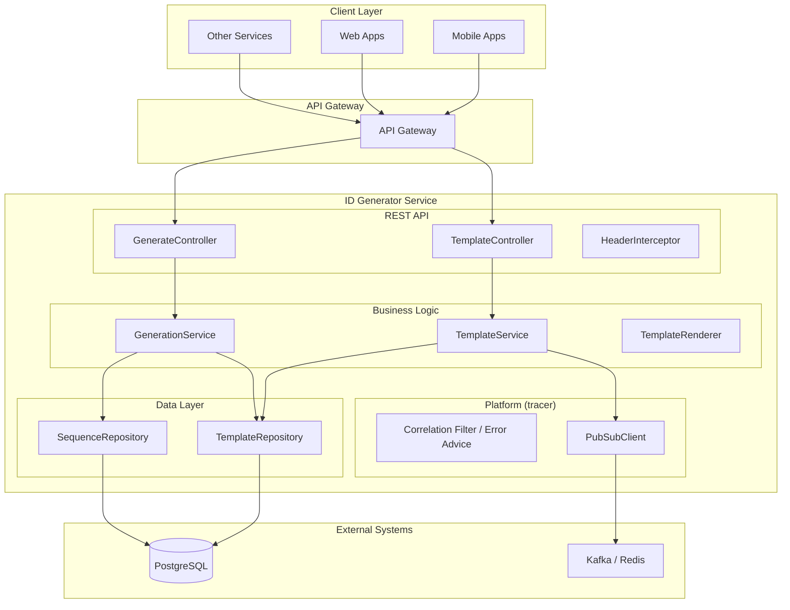
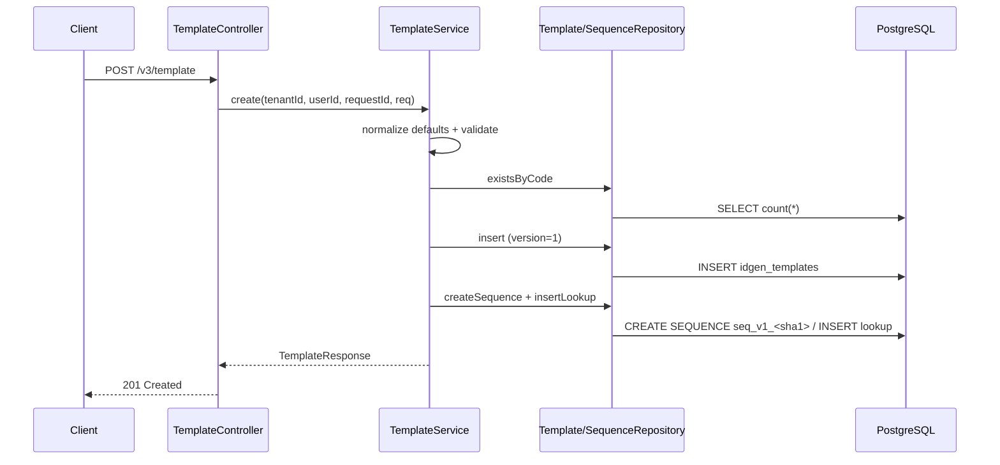

# ID Generator Service (idgen)

A DIGIT 3.0 microservice that generates unique, human-readable IDs from
user-defined templates. It supports formatted dates, scoped and padded sequences
(PostgreSQL-backed for concurrency safety), random segments with flexible
charsets, and dynamic variable substitution. Templates are registered via REST
API and IDs are generated at runtime using only the template code and input
variables.

Built on Java 25 / Spring Boot 4 and the `org.digit:tracer` platform library.

## Overview

**Service Name:** idgen

**Purpose:** Provide a robust, configurable, and deterministic ID generation
mechanism for DIGIT services using templates composed of literals, variables,
date formats, sequences, and random segments.

**Owner/Team:** DIGIT Platform Team

## Architecture

**Tech Stack:**
- Java 25
- Spring Boot 4 (Web MVC, `JdbcClient` — plain JDBC, no ORM)
- PostgreSQL (Flyway migrations, applied by the init container / tenant-migration)
- `org.digit:tracer` platform library (correlation, error contract, PubSub, observability)
- Kafka / Redis (optional pubsub for template lifecycle events)

**Core Responsibilities:**
- Register ID generation templates with JSON configuration
- Generate IDs (single and bulk) from templates using runtime variables
- Maintain PostgreSQL sequences per template with optional scope-based resets
  (GLOBAL / DAILY / MONTHLY / YEARLY)
- Validate template correctness (date formats, sequence padding, random charset)
- Maintain immutable, versioned templates (create v1, updates create v{n+1})
- Publish template lifecycle events to Kafka or Redis (optional, fire-and-forget)

**Dependencies:**
- PostgreSQL (required)
- Kafka or Redis (optional, for pubsub events)
- OpenTelemetry Collector (optional, for traces export)

### High-level Architecture Diagram



## Features

- ✅ Template registration and versioning (immutable history, per-version deletes)
- ✅ Date tokens with 30 keyword formats (`{DATE:yyyy-mm-dd}`, `{DATE:yyyymmdd}`, …)
- ✅ Scoped sequences with custom padding char and length (GLOBAL / DAILY / MONTHLY / YEARLY)
- ✅ Random segments with flexible charset ranges (`A-Z`, `0-9`, `A-Za-z0-9`, …)
- ✅ Variable substitution for custom tokens (`{city}`, `{dept}`)
- ✅ PostgreSQL-backed sequences (GLOBAL) and atomic upsert counters (scoped) for
  race-free generation — verified under parallel load
- ✅ Single and bulk ID generation (up to 1000 IDs per request, contiguous blocks)
- ✅ Canonical (header-free) twin of every route under `/v3/canonical/…`, for callers that
  cannot set custom headers
- ✅ Multi-tenant scoping via `X-Tenant-ID` — or `requestMetadata.tenantId` in the body on
  the canonical routes
- ✅ Standardised bare-array `[]Error` responses on the 3.0 routes; canonical routes wrap the
  same errors as `{responseMetadata, errors}`
- ✅ Optional Kafka / Redis publishing for template lifecycle events
- ✅ OpenTelemetry tracing and Prometheus metrics via the tracer library

## Installation & Setup

### Local Development

```bash
# 1. Start PostgreSQL and create the database
psql -h localhost -U postgres -c "CREATE DATABASE idgen_db"

# 2. Migrate the scratch database (boot-time Flyway is off by default)
JAVA_HOME=<jdk-25> SPRING_FLYWAY_ENABLED=true mvn spring-boot:run
#    ...or run src/main/resources/db/migrate.sh and start without the override

# 3. Verify
curl http://localhost:8100/idgen/actuator/health
```

Kafka/Redis and an OTLP collector are optional; without a broker, template
lifecycle events are logged-and-skipped and everything else works.

### Tests

```bash
JAVA_HOME=<jdk-25> mvn clean verify   # unit + MockMvc contract tests
```

## Configuration

All settings are standard Spring properties (`application.properties`,
overridable via env vars / CLI flags).

### Server

| Property | Default |
|---|---|
| `server.port` | `8100` |
| `server.servlet.context-path` | `/idgen` |

### Database

| Property | Default |
|---|---|
| `spring.datasource.url` | `jdbc:postgresql://localhost:5432/idgen_db` |
| `spring.datasource.username` / `password` | `postgres` / `postgres` |
| `spring.flyway.enabled` | `false` — the init container owns `public`, tenant-migration owns each tenant schema. Set `true` only to migrate a scratch database locally |

### Per-tenant schemas (`com.digit:tenant-migration`)

| Property | Default | Description |
|---|---|---|
| `digit.tenant-migration.enabled` | `false` | Per-tenant schemas, set once at initial deployment. **The request filter is active either way** — it wraps every request in a transaction and requires `X-Tenant-ID` |
| `digit.tenant-migration.schema-table` | `idgen_schema` | Flyway history table for tenant schemas; **must equal** the init container's `migrate.sh -table` |
| `digit.tenant-migration.consumer-group` | `idgen` | Consumer group for `account-migration`; pinned rather than defaulting to `spring.application.name` |

### Service

| Property | Default | Description |
|---|---|---|
| `idgen.canonical-path` | `canonical` | Path segment of the header-free routes: `/v3/{canonical-path}/…` |
| `idgen.timezone` | `UTC` | zone for `{DATE:*}` rendering and scope keys (audit/event times are epoch ms, zone-free) |
| `idgen.events.enabled` | `false` | template lifecycle events |
| `idgen.events.topics.create` | `idgen-create-template` | |
| `idgen.events.topics.update` | `idgen-update-template` | |
| `idgen.events.topics.delete` | `idgen-delete-template` | |

### PubSub (tracer)

| Property | Default | Description |
|---|---|---|
| `tracer.pubsub.type` | `kafka` | `kafka` or `redis` |
| `spring.kafka.bootstrap-servers` | `localhost:9092` | |
| `spring.data.redis.host` / `port` | `localhost` / `6379` | when using the redis backend (also set `management.health.redis.enabled=true`) |

### Observability

| Property | Default |
|---|---|
| `management.tracing.export.enabled` | `false` |
| `management.otlp.metrics.export.enabled` | `false` |
| `management.opentelemetry.tracing.export.otlp.endpoint` | `http://localhost:4318/v1/traces` |
| `management.tracing.sampling.probability` | `1.0` |
| `management.endpoints.web.exposure.include` | `health,info,prometheus,metrics` |

### Database Schema

Migrations live in `src/main/resources/db/migration`. They are applied by the
deploy-time init container to `public`, and by tenant-migration to each tenant
schema — not at application boot (`spring.flyway.enabled=false`). Resulting schema:

```sql
-- Templates (one row per version)
CREATE TABLE idgen_templates (
    id             UUID PRIMARY KEY,
    tenantid       VARCHAR(64)  NOT NULL,
    templatecode   VARCHAR(64)  NOT NULL,
    version        INTEGER      NOT NULL CHECK (version > 0),
    config         JSONB        NOT NULL,
    "createdTime"  BIGINT,
    "createdBy"    VARCHAR(64),
    "modifiedTime" BIGINT,
    "modifiedBy"   VARCHAR(64),
    requestid      TEXT,
    UNIQUE (tenantid, templatecode, version)
);

-- Scope-based counter per window (DAILY/MONTHLY/YEARLY)
CREATE TABLE idgen_sequence_resets (
    id            UUID PRIMARY KEY,
    tenantid      VARCHAR(64) NOT NULL,
    templatecode  VARCHAR(64) NOT NULL,
    scopekey      VARCHAR(32) NOT NULL,  -- "2026-05-18" (DAILY), "2026-05" (MONTHLY), "2026" (YEARLY)
    lastvalue     BIGINT      NOT NULL DEFAULT 0,
    requestid     TEXT,
    UNIQUE (tenantid, templatecode, scopekey)
);

-- Maps template codes to their PostgreSQL sequence names
CREATE TABLE idgen_sequence_lookup (
    id            UUID PRIMARY KEY,
    seqname       VARCHAR(256) NOT NULL UNIQUE,
    tenantid      VARCHAR(64)  NOT NULL,
    templatecode  VARCHAR(64)  NOT NULL,
    requestid     TEXT,
    UNIQUE (tenantid, templatecode)
);
```

**Per-template PostgreSQL sequence**, created at template registration with a
deterministic name:

```sql
-- seq_v1_<sha1hex(tenantId:templateCode)>
CREATE SEQUENCE seq_v1_<sha1hex> START WITH <start> INCREMENT BY 1 NO CYCLE;
```

Flyway records its history in the `idgen_schema` table. A database that already
carries that history is adopted as-is (checksums validate, nothing re-runs);
fresh schemas migrate normally.

## API Reference

**Base path:** `/idgen/v3` (context path × `server.servlet.context-path`)

Every operation is served twice:

- **3.0 routes** take request metadata as `X-*` headers (below).
- **Canonical routes** take the same metadata in a `requestMetadata` object in the body,
  send no `X-*` headers at all, and wrap payloads under a generic `data` key. Query
  parameters stay query parameters. See [Canonical (header-free) API](#5-canonical-header-free-api).

Both call the same service layer: identical validation, status codes and error codes.

**Required headers (3.0 routes):**

| Header | Required on | Description |
|---|---|---|
| `X-Tenant-ID` | All endpoints | Tenant identifier for data isolation |
| `X-User-ID` | POST, PUT, DELETE template | Audit fields (createdBy / modifiedBy) |
| `X-Request-ID` | Optional | Stored on created rows, echoed in response headers |

Request bodies require `Content-Type: application/json`. Errors on the 3.0 routes are
returned as a bare JSON array of `{code, message, description, params}` objects; the
canonical routes wrap the same objects in `{responseMetadata, errors}`.

### Infrastructure

| Method | Path | Description |
|--------|------|-------------|
| `GET` | `/idgen/actuator/health` | Health check |
| `GET` | `/idgen/actuator/prometheus` | Prometheus scrape |

### 1) Create Template

`POST /v3/template` — creates version `v1` and its backing PostgreSQL sequence.

```json
{
  "templateCode": "INV-BLR",
  "config": {
    "template": "INV/{DATE:yyyy-mm-dd}/{SEQ}/{city}",
    "sequence": { "scope": "DAILY", "start": 1, "padding": { "length": 5, "char": "0" } },
    "random": { "length": 4, "charset": "A-Z0-9" }
  }
}
```

**Responses:** `201 Created` (template with persisted defaults + `auditDetail`),
`400`, `409` (code exists — use PUT), `422`, `500`



### 2) Update / Search / Delete Template

- `PUT /v3/template` — creates immutable version `v{n+1}`; never modifies or drops the
  sequence; preserves the original `createdBy`/`createdTime`. Same body as create.
  **Responses:** `200`, `400` (incl. GLOBAL start change), `404`, `500`
- `GET /v3/template` — branch priority: `ids` (comma-separated UUIDs) → `templateCode`+`version`
  → `templateCode` (latest) → all latest versions in the tenant (`limit` 1–100 default 25,
  `offset` ≥ 0, ordered by templateCode). No match returns `200 []`, never 404. `version`
  requires `templateCode`.
- `DELETE /v3/template?templateCode=&version=` — deletes exactly one version. Deleting the
  **last remaining** version also drops the PostgreSQL sequence, its lookup row, and all
  scope counter rows. **Responses:** `200 {"deleted": true}`, `400`, `404`, `500`

### 3) Generate ID

`POST /v3/generate`

```json
{ "templateCode": "INV-BLR", "variables": { "city": "BLR" } }
```
```json
{ "templateCode": "INV-BLR", "version": "v1", "id": "INV/2026-05-18/00001/BLR" }
```
**Responses:** `200`, `400`, `404`, `422` (missing variable, sequence failure), `500`

### 4) Bulk Generate IDs

`POST /v3/generate/bulk`

```json
{ "templateCode": "INV-BLR", "count": 100, "variables": { "city": "BLR" } }
```
Returns `count` IDs in sequence order (one contiguous sequence block, one random
segment per ID, all IDs share the same variables and date). Fails fast — no
partial results. `count` 1–1000. **Responses:** `200`, `400`, `404`, `422`, `500`

### 5) Canonical (header-free) API

Header-free twins of every route above, at `/idgen/v3/{canonical-path}/…`
(`idgen.canonical-path`, default `canonical`). The `X-*` headers move into
`requestMetadata` in the body; the payload sits under `data`; **query parameters stay
query parameters**.

| Method | Path | Metadata | User id |
|---|---|---|---|
| POST | `/v3/canonical/template` | body | required |
| PUT | `/v3/canonical/template` | body | required |
| GET | `/v3/canonical/template?templateCode=&version=&ids=&limit=&offset=` | body | not read |
| DELETE | `/v3/canonical/template?templateCode=&version=` | body | required |
| POST | `/v3/canonical/generate` | body | not read |
| POST | `/v3/canonical/generate/bulk` | body | not read |

```json
{
  "requestMetadata": {
    "ts": 1712830200000,
    "requestId": "req-12345-abcd",
    "tenantId": "pg",
    "userInfo": { "userId": "u1" }
  },
  "data": { "templateCode": "INV-BLR", "config": { "template": "INV/{SEQ}" } }
}
```
```json
{
  "responseMetadata": { "ts": 1712830212345, "responseTime": 12, "requestId": "req-12345-abcd", "status": "SUCCESSFUL" },
  "data": { "id": "…", "templateCode": "INV-BLR", "version": "v1", "config": { "template": "INV/{SEQ}" } }
}
```

Notes that catch people out:

- **`data` is whatever the 3.0 route exchanged** — an object here, an array for search
  results, `{"deleted": true}` for delete. Errors carry
  `{"responseMetadata": {… "status": "FAILED"}, "errors": [ … ]}` with the same codes as the
  3.0 routes.
- **A missing or blank `requestMetadata.userInfo.userId`** on an operation that needs it is a
  `400 MISSING_HEADER` naming `requestMetadata.userInfo.userId` — the same code the 3.0
  route uses for an absent `X-User-ID`. Delete requires it even though the service records
  no audit row for a delete, mirroring the 3.0 route's demand.
- **The canonical GET carries its metadata in a request body.** Postman prunes GET bodies
  by default, so that request sets `protocolProfileBehavior.disableBodyPruning: true` in the
  collection — keep it if you copy the request, or the body is silently dropped.

### Error Codes

| HTTP Status | Code | Condition |
|---|---|---|
| 400 | `MISSING_HEADER` | required header absent/blank (names in `params`) |
| 400 | `VALIDATION_ERROR` | invalid query parameter values |
| 400 | `INVALID_PARAM` | unparseable UUID in `ids` |
| 400 | `INVALID_REQUEST` | semantic template errors (charset, padding, date keyword, version format, GLOBAL start change) |
| 409 | `CONFLICT` | duplicate templateCode on create; concurrent-update version conflict |
| 404 | `NOT_FOUND` | template / version missing |
| 422 | `UNPROCESSABLE` | generation failed after template found (missing variable, sequence exhaustion, incomplete legacy config) |
| 400/500 | *(tracer codes)* | malformed JSON, bean-validation failures, database errors — handled by the tracer's advice |

401/403 are enforced at the API gateway.

## Business Logic

### Template Configuration Schema

```json
{
  "templateCode": "INV-BLR",
  "config": {
    "template": "INV/{DATE:yyyy-mm-dd}/{SEQ}/{city}",
    "sequence": {
      "scope": "DAILY",
      "start": 1,
      "padding": { "length": 5, "char": "0" }
    },
    "random": {
      "length": 4,
      "charset": "A-Z0-9"
    }
  }
}
```

#### Template

- **Type:** string (2–256 chars)
- **Value:** a pattern containing static text and dynamic tokens

| Token | Example | Output | Description |
|---|---|---|---|
| `{DATE:format}` | `{DATE:yyyy-mm-dd}` | `2026-05-18` | Current date in the given format |
| `{SEQ}` | `{SEQ}` | `00001` | Next sequence value, optionally padded |
| `{RAND}` | `{RAND}` | `K3TX` | Random string from the configured charset |
| `{variableName}` | `{city}` | `BLR` | Substituted from the request `variables` map |

`{SEQ}`, `{RAND}` and the `DATE:` prefix are case-insensitive; **variable names
are case-sensitive**. Any token that is not SEQ/RAND/DATE is treated as a
variable — if the request supplies no value for it, generation fails with 422.

**Supported date format keywords** (case-insensitive; `mm` is always month):

`yyyymmdd`, `ddmmyyyy`, `mmddyyyy`, `yymmdd`, `ddmmyy`, `mmddyy`,
`yyyy-mm-dd`, `dd-mm-yyyy`, `mm-dd-yyyy`, `yy-mm-dd`, `dd-mm-yy`,
`yyyy/mm/dd`, `dd/mm/yyyy`, `mm/dd/yyyy`, `yy/mm/dd`, `dd/mm/yy`,
`yyyy.mm.dd`, `dd.mm.yyyy`, `mm.dd.yyyy`, `yy.mm.dd`, `dd.mm.yy`,
`mmyyyy`, `mm-yyyy`, `mm/yyyy`, `mm.yyyy`, `yyyy-mm`, `yyyy/mm`, `yyyy.mm`,
`yyyy`, `yy`

#### Sequence

Controls the `{SEQ}` token.

| Property | Type | Default | Description |
|---|---|---|---|
| `scope` | string | `GLOBAL` | When the counter resets: `GLOBAL` (never), `DAILY`, `MONTHLY`, `YEARLY` |
| `start` | integer ≥ 1 | `1` | Initial value on first use or after each reset |
| `padding.length` | integer 1–10 | `4` | Minimum character width; short values are left-padded |
| `padding.char` | alphanumeric char | `"0"` | Padding character (`"0"` → `1` becomes `0001`) |

Omit `padding` entirely to disable padding. Padding length must be at least the
digit count of `start`. For GLOBAL templates `start` cannot be changed by an
update (the backing sequence never resets); scoped starts take effect at the
next window.

#### Random

Controls the `{RAND}` token.

| Property | Type | Default | Description |
|---|---|---|---|
| `length` | integer 1–10 | `2` | Number of characters to generate |
| `charset` | string | `"A-Z0-9"` | Allowed characters; same-class ranges (`A-Z`, `a-z`, `0-9`) and single alphanumerics |

Defaults are applied server-side and persisted with the template.

### Runtime Evaluation Flow

1. Load the latest template version for (tenantId, templateCode).
2. If the template uses `{SEQ}`: allocate value(s) —
   - GLOBAL → `nextval()` on the template's PostgreSQL sequence
     (bulk: one `generate_series` round trip);
   - scoped → one atomic upsert on the window's counter row (a new scope key
     lazily starts a fresh window).
   - A DB error fails the request immediately with 422. There is no retry: the
     tenant-migration filter wraps each request in a transaction, so a failed
     statement aborts it and retrying in place cannot succeed. Callers retry the
     request.
3. If the template uses `{RAND}`: generate per-ID random characters from the
   expanded charset.
4. Substitute every token — static text verbatim, dates formatted with the
   configured `idgen.timezone` — and return the concatenated ID(s).

### Multi-tenant Architecture

All operations are scoped by the `X-Tenant-ID` header down to every SQL statement.
Schema-per-tenant separation is integrated via `com.digit:tenant-migration`, off by default
(`digit.tenant-migration.enabled=false`, in which case everything stays in `public` and the
tenant is a column predicate).

Two behaviours apply **regardless of the flag**, because the library's filter registers
unconditionally: every request runs inside a database transaction (committed on `<400`,
rolled back otherwise), and a missing `X-Tenant-ID` is rejected by the filter before the
`HeaderInterceptor` — same `400`/`MISSING_HEADER`, but the header is named in `message`
rather than `params`, with `X-Error-Source: tenant-migration` set.

## Project Structure

```
idgen/
├── pom.xml
├── IDGen-3.0.postman_collection.json
├── src/main/java/org/digit/idgen/
│   ├── IdgenApplication.java
│   ├── config/          # IdgenProperties, Clock bean
│   ├── web/             # TemplateController, GenerateController, HeaderInterceptor
│   ├── model/           # request/response records, TemplateConfig, SequenceScope
│   ├── service/         # TemplateService, GenerationService, TemplateRenderer
│   ├── repo/            # TemplateRepository, SequenceRepository, SequenceNames
│   └── events/          # TemplateEventPublisher
├── src/main/resources/
│   ├── application.properties
│   └── db/migration/    # Flyway SQL
└── src/test/java/...    # unit + MockMvc contract tests (3.0 + canonical)
```

## Observability

- **Traces:** HTTP server/client and JDBC spans with `tenant.id` enrichment,
  exported over OTLP (tracer + Spring Boot auto-configuration).
- **Metrics:** Prometheus scrape at `/idgen/actuator/prometheus` —
  `http_server_requests` (with `tenant_id` tag), Hikari pool metrics, and the
  business counter `ids_generated_total{id_type, tenantId}`.
- **Logs:** structured, with `CORRELATION_ID`/`TENANTID`/traceId in every line
  (tracer logback config; `production` profile switches to JSON).

## References

- OpenAPI spec (3.0 routes): [`../../../docs/services/idGen/idgen-3.0.0.yaml`](../../../docs/services/idGen/idgen-3.0.0.yaml).
  The canonical routes have no published contract yet — this README is their specification.
- Postman collection: `IDGen-3.0.postman_collection.json`
- Platform library: `org.digit:tracer` (see its README for the error contract,
  PubSub API, and observability details)

---
**Version:** 3.0.0-SNAPSHOT · **Maintainer:** DIGIT Platform Team
